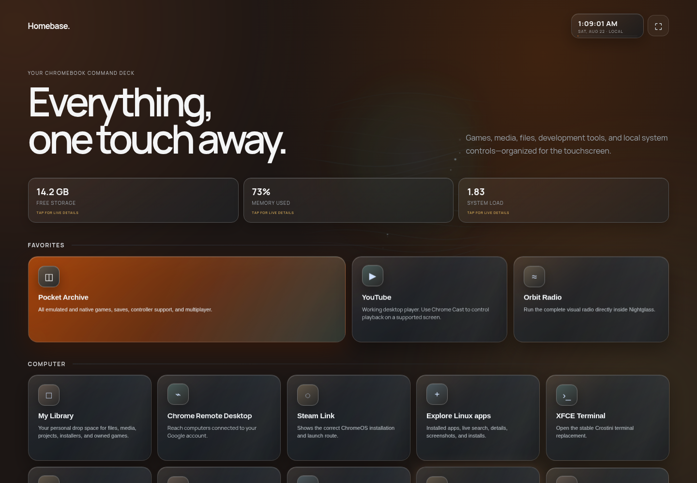

# Homebase

Homebase is a little OS-style home screen for a Chromebook or PC: one fullscreen place for apps, files, music, system information, and games you add yourself.

I wanted an easy way to get more out of a low-power Chromebook without bouncing between a pile of unrelated windows, so I made this. It is designed first for touch and an Xbox controller, but mouse and keyboard work normally too.

Here is the more organized AI-slop explanation.

## Install Homebase

You do not need to be a developer. Pick your computer, paste the highlighted line once, and Homebase handles the project download and startup.

### Chromebook or Linux

1. On Chromebook, turn on **Settings → Advanced → Developers → Linux development environment**.
2. Open the **Terminal** app.
3. Copy and paste this whole line, then press Enter:

```bash
curl -fsSL https://raw.githubusercontent.com/boredguy404/Homebase-OS/main/install.sh | bash
```

### Windows

1. Install [Python 3](https://www.python.org/downloads/windows/) and check **Add Python to PATH** during installation.
2. Open **PowerShell**.
3. Copy and paste this whole line, then press Enter:

```powershell
powershell -NoProfile -ExecutionPolicy Bypass -Command "irm https://raw.githubusercontent.com/boredguy404/Homebase-OS/main/install-windows.ps1 | iex"
```

Homebase opens automatically. In Chrome or Edge, choose **Install Homebase** to make it fullscreen and remove the address bar. Your games, saves, music, and personal files stay on your computer and are not uploaded to GitHub.

### Add games you own

Homebase ships without commercial games. To add a backup you legally made:

1. Open the installed `Homebase-OS` folder.
2. Put game files in `roms/` and required PlayStation BIOS files in `bios/`.
3. Optionally put your own cover PNGs or real gameplay GIFs in `covers/`.
4. Reload Pocket Archive, open a game card, then use **Play** or **Controller layout**.


Supported systems include Game Boy, GBC, GBA, NES, SNES, Genesis, N64, and PlayStation. The in-app **Add your games** guide explains filenames, artwork, privacy, and recommended GIF sizes. ROMs, BIOS files, saves, and private artwork are ignored by Git and remain local.



## What it feels like

- A couch-friendly launcher instead of a traditional desktop menu
- A local web app with native Linux helpers when they are available
- A personal library for files, playlists, saves, and user-provided games
- A PWA that can run fullscreen without a browser address bar
- One visual system shared by Homebase, Pocket Archive, Orbit, Settings, and tools

This is not a replacement operating system. It is a fast console-like layer over ChromeOS Linux or a desktop computer.

## Feature tour

### Pocket Archive and ROM Discovery

| Your private game shelf | Recommendation-only discovery |
|---|---|
|  |  |

Pocket Archive launches a locally installed EmulatorJS runtime for GBA, Game Boy, GBC, NES, SNES, Genesis, N64, and PlayStation files supplied by the user. Each game can have a detail sheet, swipeable gallery, Xbox controller diagram, save controls, performance profile, and fullscreen CRT presentation.

ROM Discovery is deliberately separate from the installed library. It contains recommendations, hardware-fit notes, multiplayer information, expected emulator cores, and links for researching legal copies. It does not download ROMs and does not claim a suggested game is installed.

The screenshots above use public-safe generated system panels. Personal cover files and gameplay captures are not committed.

### Orbit visual radio


Orbit combines internet radio and local audio playlists with audio-reactive visuals. Wave is the default; other modes include radar, tunnel, nebula, and a club-style light field. The selected visual continues in the low-cost mini player while navigating Homebase, with play, pause, previous, next, expand, and close controls.

### App search and installation


Homebase reads actual desktop launchers and Flatpak state before calling an app installed. Explore searches the Flathub catalog, opens an in-app detail view with screenshots, and runs installs as observable background jobs. If automatic installation is unavailable, every app includes a copyable terminal fallback:

```bash
flatpak install --user flathub APP_ID
```

Uninstall is limited to confirmed Flatpak applications and uses a double-confirm flow.

### My Library


My Library is a real browser for files inside the current user account. It supports:

- Folder navigation and breadcrumbs
- Search and name/newest/size sorting
- Image thumbnails plus image, audio, video, text, and PDF previews
- Touch upload and desktop drag-and-drop
- New folders, rename, native open, and recoverable move-to-Trash
- Long-press or right-click actions for folders and files
- Xbox navigation without stealing the B button while a game owns input

File access is confined to the current user’s home folder by the local server.

### Settings, saves, and portable backup


Settings can export or merge independent data groups: My Library, user-provided ROMs, native saves, artwork, imports, mGBA data, Orbit playlists, Flatpak data, browser preferences, and an installed-app inventory. Restore defaults to merge-and-skip; replacing matching files requires an explicit choice.

EmulatorJS saves live in browser IndexedDB, so Homebase also includes a separate browser-save export/import tool for that protected data.

### Ultra Retro

| Desktop | Orbit Radio |
| --- | --- |
|  |  |

Ultra Retro is a complete alternate shell inspired by late-'80s and '90s home computers—not a color filter. It turns Homebase into a teal desktop with a working menu bar and taskbar, chunky desktop icons, draggable system windows, era-matched loading states, and dedicated monochrome display programs for Orbit. Games return to full color when launched.

### System insight and Homebase Control

The dashboard reports real storage, memory, load, and uptime. Detail views add storage composition, large files, and active processes. Homebase Control exposes service health, controller detection, and protected native-save backups through a separate local helper.

## Input and performance

- Touch targets are enlarged on coarse-pointer displays.
- Xbox input adds contextual focus and button hints.
- Controller B is scoped away from global navigation while an emulator owns input.
- N64 fullscreen disables the expensive transparent compositor.
- The optional HUD reports frame time, dropped frames, memory trend, and a plain-English rating.
- Background visuals prefer transform/opacity animation and reduce work when hidden.

## Two-minute setup

On a Chromebook, enable Linux development environment, open Terminal, and review/run:

```bash
curl -fsSL https://raw.githubusercontent.com/boredguy404/Homebase-OS/main/install.sh | bash
```

To boot an existing checkout:

```bash
./launch-homebase.sh
```

Homebase prints the Linux container URL and opens it in Chrome. Install the page as a PWA from Chrome to remove the URL bar. See [the one-block boot guide](HOWTO.txt) for the shortest local instructions.

### Windows

The PWA shell, browser emulators, Xbox input, Orbit, My Library, browser saves, themes, and backups have a Windows path. Flatpak, Crostini launchers, native Linux games, and mGBA link-cable helpers remain Linux-only. See [Homebase on Windows](docs/WINDOWS.md).

## What works offline?

| Feature | Offline behavior |
|---|---|
| Homebase shell and installed PWA assets | Works after the service worker caches the shell |
| Emulator runtime and user-provided games | Local and offline once the runtime is installed |
| My Library, Settings, saves, and backups | Local and offline |
| Local Orbit playlists | Local and offline |
| Internet radio and YouTube | Requires internet |
| Flathub search/install and remote app screenshots | Requires internet |
| ROM Discovery text catalog | Local; remote reference media may require internet |

Google Fonts may be fetched when online, but system-font fallbacks keep the interface usable offline.

## How the pieces fit

```text
Chrome / installed PWA
├── Homebase shell, pages, themes, controller navigation
├── Pocket Archive + local EmulatorJS runtime
├── Orbit visual radio
└── HTTP API on localhost
    ├── file access limited to the user home folder
    ├── installed-app detection and Flatpak jobs
    ├── system/process/storage insight
    └── native launch and save-backup helpers
```

The repository is organized by feature instead of by file type at root:

```text
assets/
├── icons/
├── scripts/{homebase,arcade,apps,files,settings,discovery,shared}/
└── styles/{homebase,arcade,apps,files,settings,discovery,shared}/
pages/       feature entry pages
modules/     Orbit and Homebase Control services
scripts/     setup and native game helpers
docs/        setup, Windows, readiness, and repository notes
media/       public-safe README screenshots
```

See [Repository structure](docs/REPOSITORY_STRUCTURE.md) for ownership and naming rules.

## Private data and game files

This repository contains no ROMs, BIOS files, saves, imported music, commercial cover files, credentials, or local gameplay captures. Homebase never downloads commercial games. Users provide their own legally obtained files and are responsible for complying with applicable law.

The following local folders are ignored by Git:

```text
roms/  bios/  saves/  imports/  covers/  emulatorjs/
```

Selective backup archives can contain private data when the user asks for it, but those archives remain local and are also ignored.

## Security boundaries

- File routes resolve and re-check paths inside the current user’s home directory.
- Restore rejects absolute paths and `..` archive traversal.
- Browser mutations require same-origin requests.
- File deletion uses the recoverable system Trash.
- App removal is restricted to detected Flatpak IDs.
- Public-release checks exclude game files, BIOS files, saves, music, logs, credentials, and downloaded runtimes.

## Current scope

Homebase began on an ARM Chromebook, so ChromeOS/Crostini is the best-tested path. Native integrations depend on what the host has installed. Static GitHub Pages cannot launch local apps or inspect a computer; those features require the included local Python server.

## Support

<a href="https://cash.app/$sitedeveloper"></a>

Homebase started as one person trying to get more life out of a low-power Chromebook. If it made your computer more useful—or you just want to help fund another late-night build—you can [buy development a coffee through Cash App](https://cash.app/$sitedeveloper).

No pressure and no feature paywalls. Contributions, bug reports, screenshots, and thoughtful ideas help just as much.

## Contributing and license

Contributions are encouraged—bug fixes, accessibility improvements, new platform support, documentation, design work, and focused feature pull requests can all help make Homebase a great product for everyone. Start with [CONTRIBUTING.md](CONTRIBUTING.md).

Homebase is source-available under the [PolyForm Noncommercial License 1.0.0](LICENSE). Personal and other noncommercial use, modification, and sharing are welcome under its terms. Commercial use, resale, paid redistribution, or bundling Homebase into a commercial product requires separate written permission from the project owner; open a GitHub issue to discuss permission.

This is a noncommercial source-available license, not an OSI-approved open-source license. EmulatorJS, emulator cores, radio sources, and applications retain their own licenses and are not redistributed by this repository.
