# NovaShell

> **NovaShell is an installable local dashboard that sits on top of ChromeOS/Linux or Windows.** It turns a Chromebook or PC into one touch-first, controller-friendly home screen for the apps and files already on the computer, a private game shelf for games you add yourself, Orbit radio and local music, live device insight, backups, weather, utilities, and a local-first Relay assistant. It can run as a PWA or fullscreen deck, and it remains useful offline after its shell and local tools are installed.

It is a lightweight layer over your existing computer—not a replacement operating system, cloud service, game download site, or remote-control agent. NovaShell never bundles commercial games, silently uploads your library, or claims it can launch software the browser cannot access. Local Linux app launching, real file browsing, and native helpers stay clearly local-only; the hosted companion uses browser-safe equivalents. Some `homebase-*` internal names remain temporarily so existing local preferences migrate cleanly.

I wanted an easy way to get more out of a low-power Chromebook without bouncing between a pile of unrelated windows, so I made this. It is designed first for touch and an Xbox controller, but mouse and keyboard work normally too.

Here is the more organized AI-slop explanation.

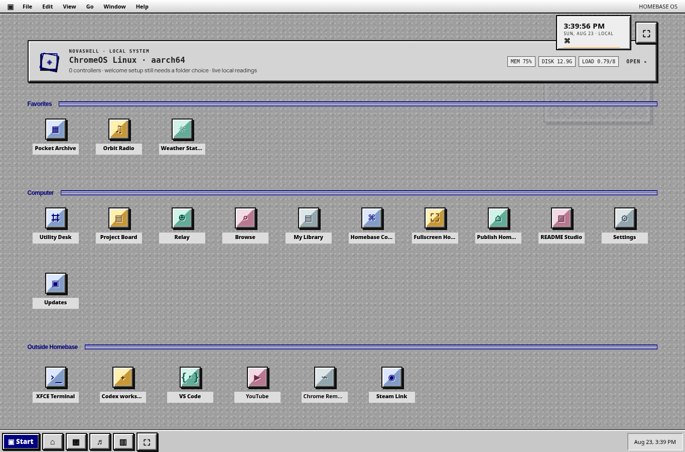

**Ultra Retro is Homebase’s advertised default:** a full desktop-style shell with a taskbar, menu bar, windows, and pixel-era visual language. For a contemporary alternative, switch to **Cobalt + Radar** in Settings.

## Hosted NovaShell companion

[Open NovaShell on the web →](https://novashell.app) *(deployment is being prepared; the local companion remains the full Chromebook/PC edition until this link is live.)*

The hosted companion is intended to carry the PWA shell, touch/controller navigation, browser game imports, Orbit, playlists, notes, kanban, discovery, weather, and browser-backed storage. Local Linux app launching, unrestricted file scanning, and native helpers remain clearly labeled local-only capabilities.

Deployment credentials, host setup, and operator notes are deliberately private. The separate **NovaShell web** repository is reserved for the deployable browser companion when it is ready—not for publishing infrastructure instructions.

See the [hosted companion parity matrix](docs/HOSTED_COMPANION_PARITY.md) for the exact local-vs-web boundary before deploying a companion build.

## Install Homebase

You do not need to be a developer. Pick your computer, paste the highlighted line once, and Homebase handles the project download and startup.

### Chromebook or Linux

1. On Chromebook, turn on **Settings → Advanced → Developers → Linux development environment**.
2. Open the **Terminal** app.
3. Copy and paste this whole line, then press Enter:

```bash
curl -fsSL https://raw.githubusercontent.com/boredguy404/Homebase-OS/main/install.sh | bash
```

### Windows

1. Install [Python 3](https://www.python.org/downloads/windows/) and check **Add Python to PATH** during installation.
2. Open **PowerShell**.
3. Copy and paste this whole line, then press Enter:

```powershell
powershell -NoProfile -ExecutionPolicy Bypass -Command "irm https://raw.githubusercontent.com/boredguy404/Homebase-OS/main/install-windows.ps1 | iex"
```

Homebase opens automatically. In Chrome or Edge, choose **Install Homebase** to make it fullscreen and remove the address bar. Your games, saves, music, and personal files stay on your computer and are not uploaded to GitHub.

On its first launch, the three-step welcome setup shows the local device reading, asks exactly which folders may be scanned, then gives direct shortcuts to My Library, owned-game setup, backup and restore, and controller help. The retro update bulletin never covers this setup flow.

### EmulatorJS runtime (automatic)

Both installers download and unpack the local **EmulatorJS 4.2.3 runtime** on first install (roughly 290 MB), then verify `emulatorjs/data/loader.js` exists before Homebase starts. On Windows, the installer uses the free 7-Zip helper and offers to install it through Winget when needed. It is a local dependency—not something users need to add by hand—and remains ignored by Git. If a first install was interrupted, run the same installer command again; it resumes by installing only a missing runtime. The official EmulatorJS 4.2.3 release is the runtime source. [EmulatorJS release](https://github.com/EmulatorJS/EmulatorJS/releases)

### Add games you own

Homebase ships without commercial games. To add a backup you legally made:

1. Open the installed `Homebase-OS` folder.
2. Put game files in `roms/` and required PlayStation BIOS files in `bios/`.
3. Optionally put your own cover PNGs or real gameplay GIFs in `covers/`.
4. Reload Pocket Archive, open a game card, then use **Play** or **Controller layout**.

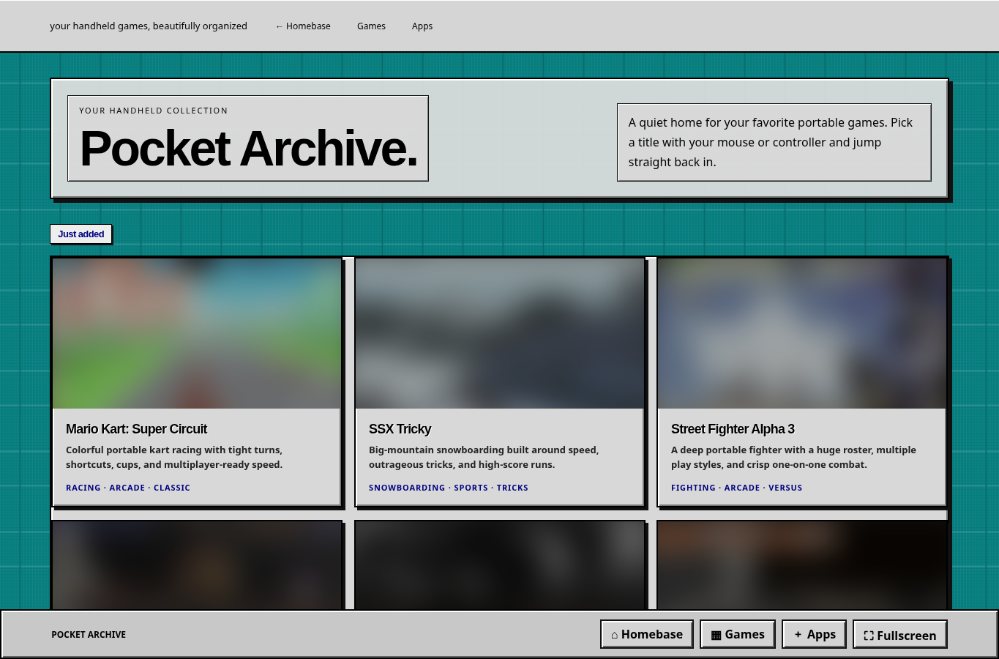

> **Why the pixelation?** Public screenshots use a retro mosaic treatment whenever they could reveal local ROM covers or gameplay. The actual local Pocket Archive shows the real images supplied by its owner; the public repository does not publish those private or copyrighted assets.

Supported systems include Game Boy, GBC, GBA, NES, SNES, Genesis, N64, and PlayStation.

For a real one- or two-controller validation on the target device, use the short [Xbox controller smoke test](docs/HARDWARE_CONTROLLER_SMOKE.md). It separates Chrome gamepad visibility, shelf navigation, emulator input ownership, and local multiplayer so a game-specific control issue is easy to identify.

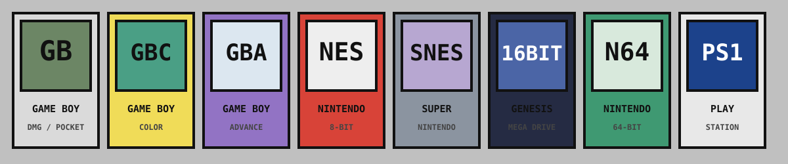

The in-app **Add your games** guide explains filenames, artwork, privacy, and recommended GIF sizes. ROMs, BIOS files, saves, and private artwork are ignored by Git and remain local.

## What it feels like

- A couch-friendly launcher instead of a traditional desktop menu
- A local web app with native Linux helpers when they are available
- A personal library for files, playlists, saves, and user-provided games
- A PWA that can run fullscreen without a browser address bar
- One visual system shared by Homebase, Pocket Archive, Orbit, Settings, and tools

This is not a replacement operating system. It is a fast console-like layer over ChromeOS Linux or a desktop computer.

## Feature tour

### Pocket Archive and ROM Discovery

| Your private game shelf | Recommendation-only discovery |
|---|---|
|  | 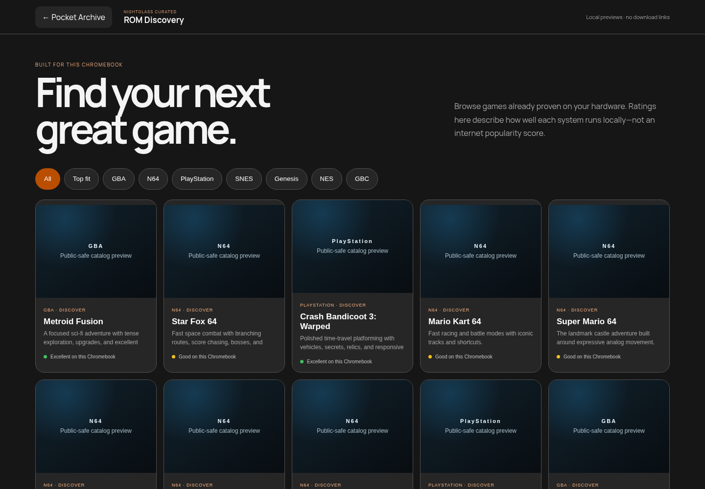 |

Pocket Archive launches a locally installed EmulatorJS runtime for GBA, Game Boy, GBC, NES, SNES, Genesis, N64, and PlayStation files supplied by the user. Each game can have a detail sheet, swipeable gallery, Xbox controller diagram, save controls, performance profile, and fullscreen CRT presentation. Two connected Xbox controllers are forwarded to player one and player two for every supported core; a game that has no local multiplayer simply ignores player two. In the library, Xbox **B** closes an open detail sheet before returning Homebase; once a game is running, the emulator owns B normally.

The shelf scans `roms/` and My Library when it opens, so newly added supported files appear without maintaining a second list. Its compact **System** and **Type** filters are touch-sized, spaced apart, and scroll horizontally on narrow screens. Existing owner-supplied cover PNGs and gameplay GIFs are used first; when no local artwork exists, NovaShell shows an honest system card instead of a broken image.

ROM Discovery is deliberately separate from the installed library. It contains recommendations, hardware-fit notes, multiplayer information, expected emulator cores, and links for researching legal copies. It does not download ROMs and does not claim a suggested game is installed.

The Pocket Archive documentation capture uses a deliberate pixel-mosaic privacy treatment over local game imagery. It communicates the real shelf without publishing sharp cover art or gameplay captures; in the installed local app, owners still see their own real images. Personal ROMs, saves, and source artwork are not committed.

### Orbit visual radio

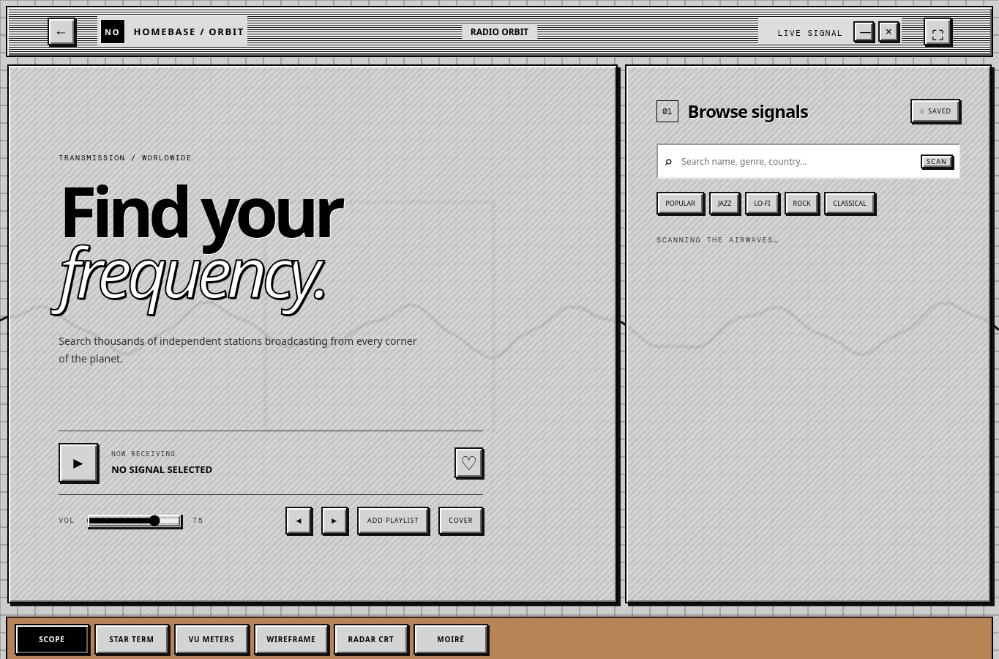

Orbit combines internet radio and local audio playlists with audio-reactive visuals. **Pulse** is the default; other modes include Scope, radar, tunnel, nebula, and a club-style light field. Its full-height station rail keeps search and filters in view while every returned station stays scrollable. The selected visual continues in the low-cost mini player while navigating NovaShell, with play, pause, previous, next, expand, and close controls.

### Relay workspace

Relay works as a local guide without a key. Its normal chat reports approved local status, can navigate NovaShell, and mirrors the current build feed. For richer chat and drafts, **AI Routes** can save an OpenAI, OpenRouter, Groq, or Gemini profile on this computer only. Before saving a key, Relay plainly states that route’s best use, account/free-tier limit, data boundary, and the distinction between AI drafting and command execution. Free tiers are optional, rate-limited, and provider-controlled. Its **Brain Files** browser exposes the locally imported Brain archive in read-only form: conventions, notes, structure, and utilities can be inspected without placing that private archive in Git.

Its **Local Keyring** shows only safe configuration status—provider, model, storage boundary, and backup exclusion. It never displays a secret value. A deliberate two-tap control can remove NovaShell’s saved Relay provider profile without touching a separate legacy key file.

The **Workspace Editor** can load an allowlisted set of NovaShell core files, create a review-only AI draft, and apply a reviewed edit only after explicit typed confirmation. Every write makes a timestamped local backup. Generated mini-apps use the Web Components contract and remain isolated in `user-apps/`; they do not gain core-file access. The separate **Local Codex** tool runs only in the fixed local checkout and requires a typed confirmation before it starts; it is intentionally powerful and is not exposed by the hosted companion. Relay’s **Test saved route** button makes one small, on-demand request so a person can distinguish a missing key, unavailable provider, or a rate-limited route before asking it to draft work. Utility Desk also includes a local project Kanban, seeded with current work on first use and fully editable without an account.

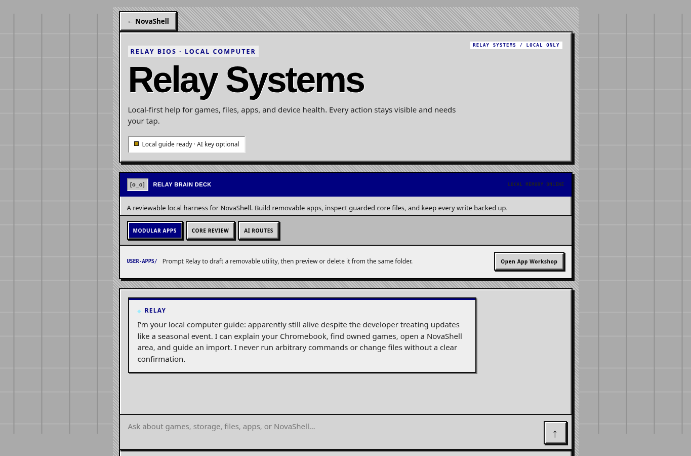

### Utility Desk and local handoffs

Utility Desk is deliberately useful without an account or a network connection: live device readings, notes, calculator, clipboard handoff, focus timer, converter, local SHA-256 file verification, quick queue, Kanban, and a **Workspace handoff** tool. Choose a folder and it creates a downloadable JSON inventory with relative names, timestamps, sizes, and fingerprints—never file contents or absolute paths. That makes a copied folder, backup, or support handoff explainable without uploading private data.

**Quick commands** is the matching local command layer: press `Ctrl`/`⌘` + `K`, or use its desktop tile, to search the same visible NovaShell routes. It opens only explicit in-app panels and display controls; Xbox D-pad/A/B works while the palette is open.

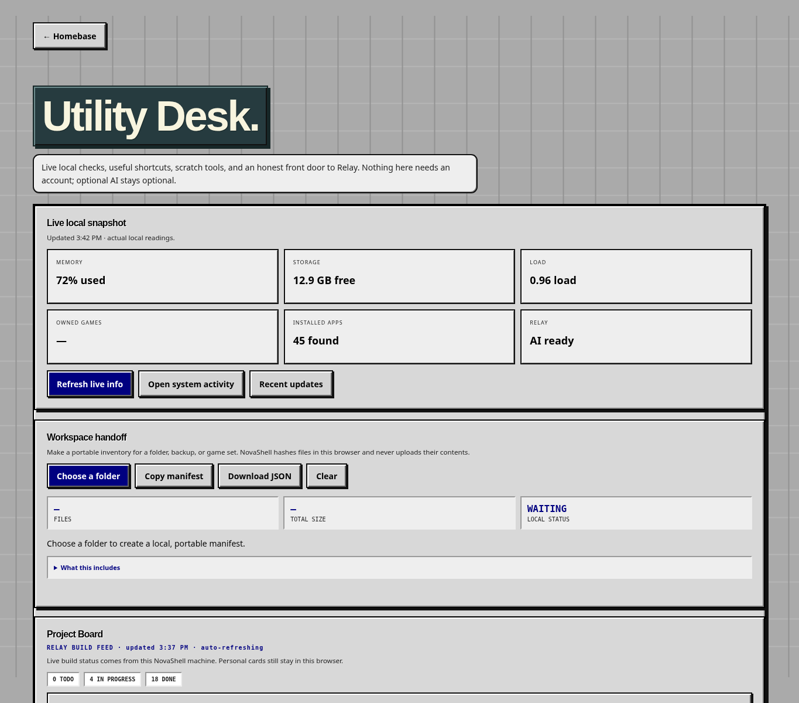

### Maker Desk

Maker Desk is a removable local app for sketching a compact 16 × 12 tile map on touch. It saves only in the current browser, then exports ordinary JSON for a future game-engine project. It does not contain an engine, game assets, or network calls.

**Quest Board** is the companion dashboard for that map contract. It browses the saved local project, opens Maker Desk for editing, and provides an original top-down playable preview with keyboard and Xbox D-pad movement. It uses no copied archived game code or assets.

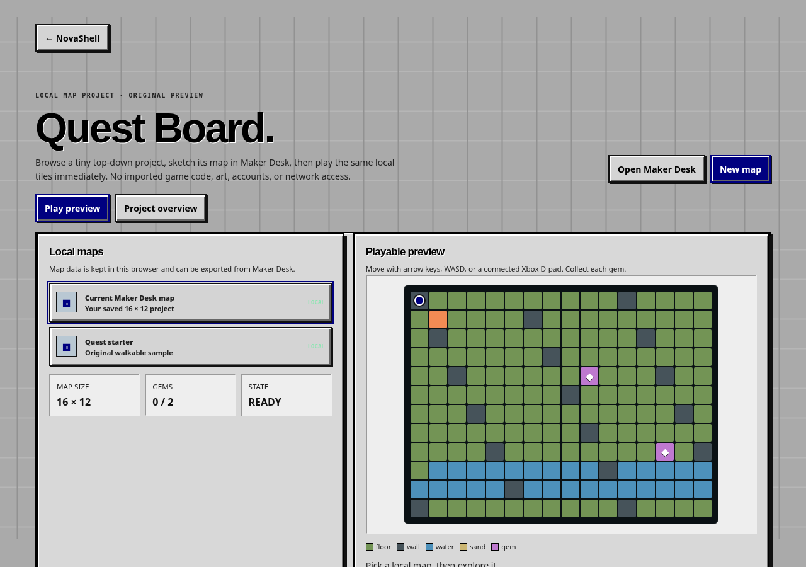

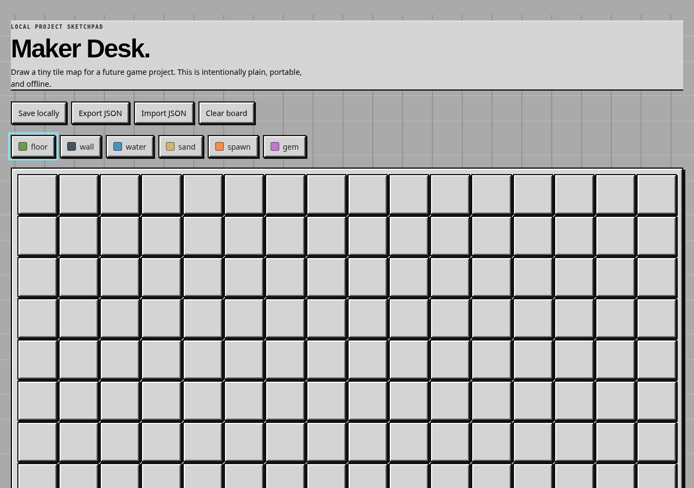

The quiet **About NovaShell** window is available from the desktop Help menu and My Library. It credits [boredguy404](https://github.com/boredguy404) without turning the desktop into an advertisement.

### App search and installation


NovaShell reads actual desktop launchers and Flatpak state before calling an app installed. The **Browse** internet-style explorer includes live News, AI, Dev, Security, Research, Games, Books, Reference, open-source tools, Linux apps, and a searchable catalog of **unique free no-key APIs**. API detail sheets show a live example URL, method, base URL, path, and a copy button—not merely a documentation link. Each lane has paging, source links, touch-friendly detail sheets, and dedicated Ultra Retro reading surfaces so text stays legible over the desktop pattern. Linux App Explore searches the Flathub catalog, opens an in-app detail view with screenshots, and runs installs as observable background jobs. If automatic installation is unavailable, every app includes a copyable terminal fallback:

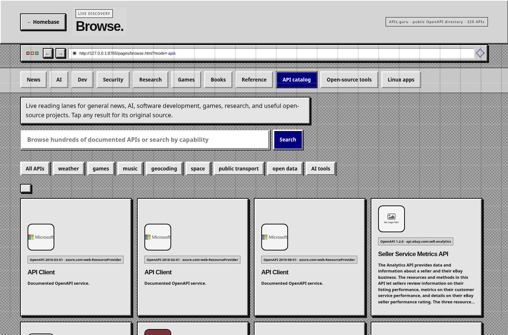

```bash
flatpak install --user flathub APP_ID
```

Uninstall is limited to confirmed Flatpak applications and uses a double-confirm flow.

### My Library

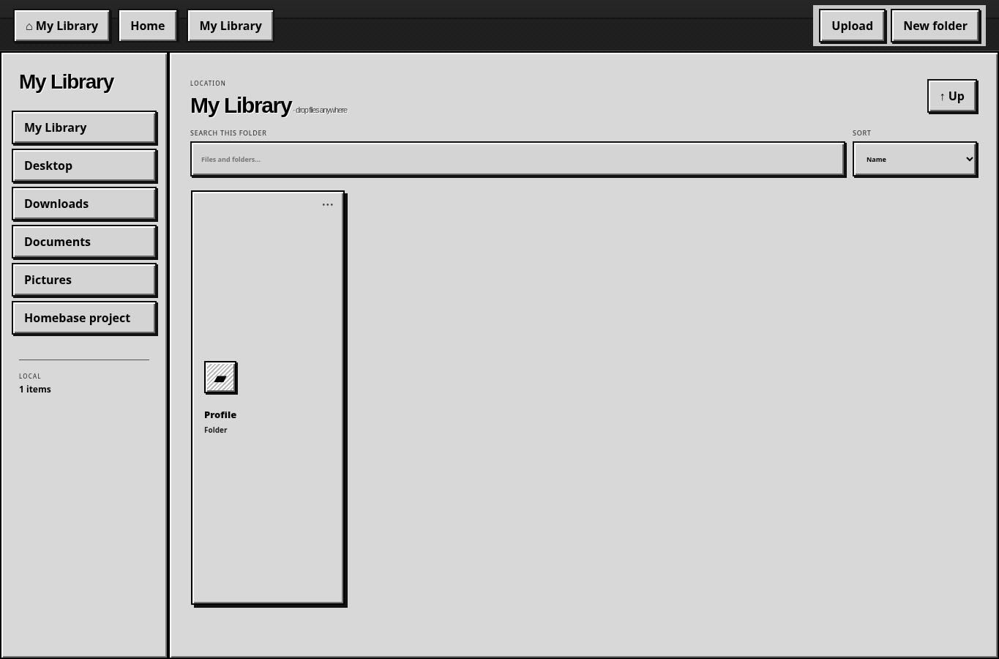

My Library is a real browser for files inside the current user account. It supports:

- Folder navigation and breadcrumbs
- Search and name/newest/size sorting
- Image thumbnails plus image, audio, video, text, and PDF previews
- A local Gallery mode for the images in the current folder, reusing the same in-app preview
- Touch upload and desktop drag-and-drop
- New folders, rename, native open, and recoverable move-to-Trash
- Long-press or right-click actions for folders and files
- Xbox navigation without stealing the B button while a game owns input

File access is confined to the current user’s home folder by the local server.

### Settings, saves, and portable backup

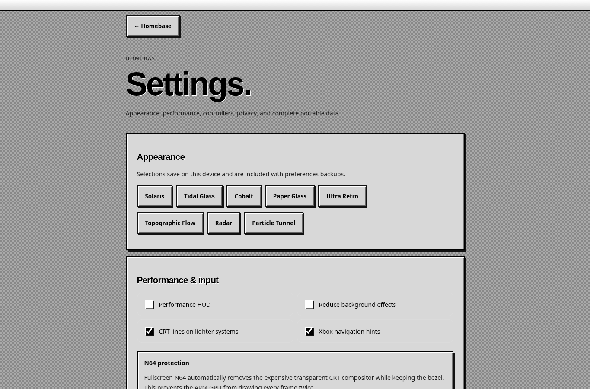

Settings can export or merge independent data groups: My Library, user-provided ROMs, **game-card details and controller notes**, native saves, artwork, imports, mGBA data, Orbit playlists, Flatpak data, browser preferences, and an installed-app inventory. Preferences include the local Project Board and desktop layout; provider credentials are never exported. Restore defaults to inspect-before-merge and skip conflicts; replacing matching files requires an explicit choice.

The README uses crisp current Settings captures. Pixel-mosaic treatment is reserved only for public game-shelf imagery that could expose local ROM covers or gameplay; it is a real low-resolution pixel mosaic, not a blur.

EmulatorJS saves live in browser IndexedDB, so Homebase also includes a separate browser-save export/import tool for that protected data.

### Ultra Retro

| Desktop | Orbit Radio |
| --- | --- |
|  | 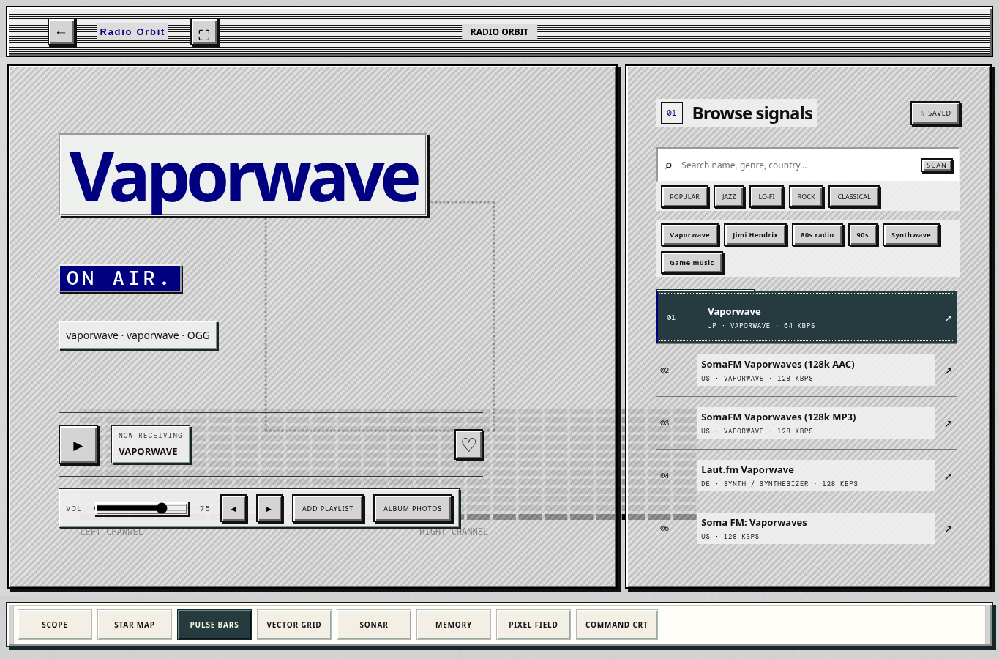 |

Ultra Retro is a complete alternate shell inspired by late-'80s and '90s home computers—not a color filter. It turns Homebase into a teal desktop with a working menu bar and taskbar, chunky desktop icons, draggable system windows, era-matched loading states, and dedicated monochrome display programs for Orbit. Games return to full color when launched.

### Optional modern view: Cobalt + Radar

| Cobalt Homebase | Cobalt Radar | Cobalt Linux Apps |
| --- | --- | --- |
| 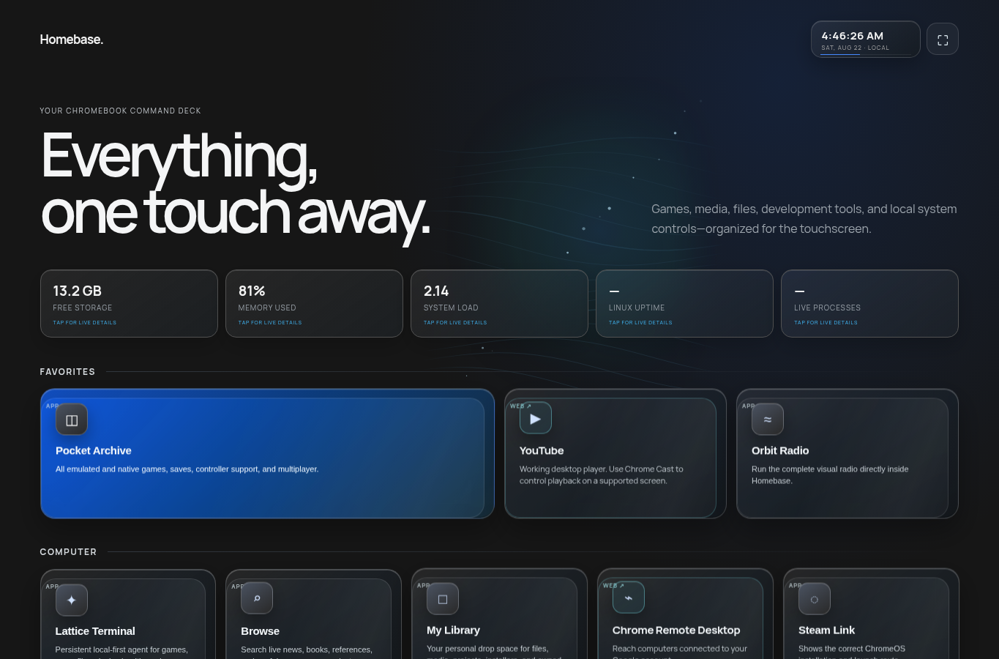 | 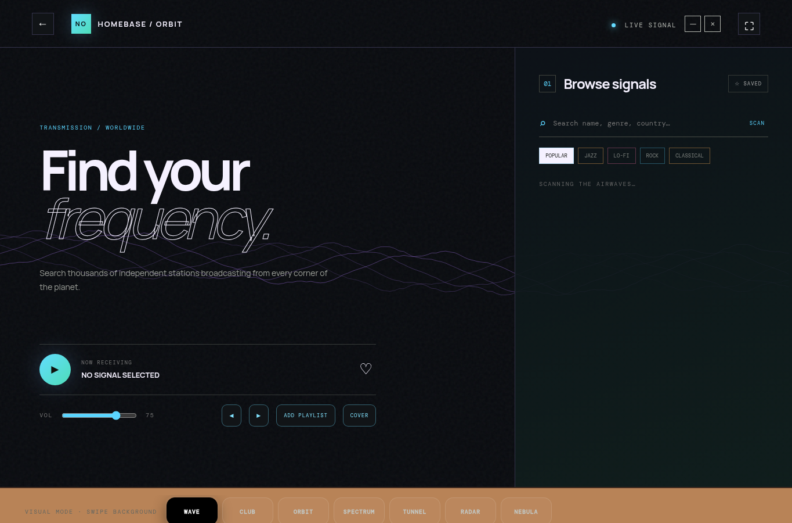 | 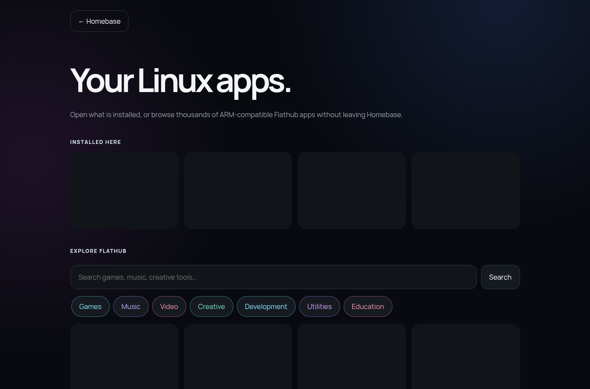 |

Cobalt + Radar is one compact optional modern view. It is kept as an alternative—not the project’s public identity—while Ultra Retro remains the first screenshot and the main presentation theme.

### System insight and Homebase Control

The dashboard begins with a compact local-system display rather than generic KPIs: OS and architecture, controller state, memory, storage, and load. Detail views add storage composition, large files, and active processes. Homebase Control exposes service health, controller detection, and protected native-save backups through a separate local helper.

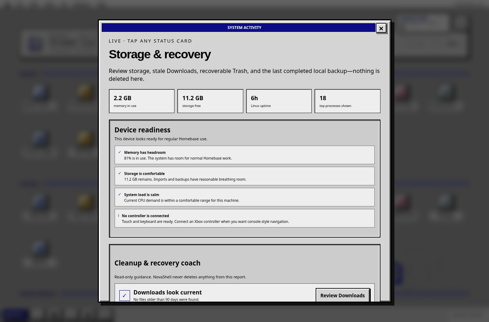

**Device Readiness** interprets the same local measurements before suggesting anything: memory headroom, storage breathing room, current CPU demand, controller presence, and whether first-run setup is complete. It never kills processes, deletes files, or changes a setting on its own; any offered action is a visible jump to the relevant screen.

## Input and performance

- Touch targets are enlarged on coarse-pointer displays.
- Xbox input adds contextual focus and button hints.
- Controller B is scoped away from global navigation while an emulator owns input.
- N64 fullscreen disables the expensive transparent compositor.
- The optional HUD reports frame time, dropped frames, memory trend, and a plain-English rating.
- Background visuals prefer transform/opacity animation and reduce work when hidden.

## Two-minute setup

On a Chromebook, enable Linux development environment, open Terminal, and review/run:

```bash
curl -fsSL https://raw.githubusercontent.com/boredguy404/Homebase-OS/main/install.sh | bash
```

To boot an existing checkout:

```bash
./launch-homebase.sh
```

Homebase prints the Linux container URL and opens it in Chrome. Install the page as a PWA from Chrome to remove the URL bar. See [the one-block boot guide](HOWTO.txt) for the shortest local instructions.

### Windows

The PWA shell, browser emulators, Xbox input, Orbit, My Library, browser saves, themes, and backups have a Windows path. Flatpak, Crostini launchers, native Linux games, and mGBA link-cable helpers remain Linux-only. See [Homebase on Windows](docs/WINDOWS.md).

## What works offline?

| Feature | Offline behavior |
|---|---|
| Homebase shell and installed PWA assets | Works after the service worker caches the shell; direct routes with query parameters fall back to their cached page, and a clear local offline page appears if a page was never cached |
| Emulator runtime and user-provided games | Local and offline once the runtime is installed |
| My Library, Settings, saves, and backups | Local and offline |
| Local Orbit playlists | Local and offline |
| Internet radio and YouTube | Requires internet |
| Flathub search/install and remote app screenshots | Requires internet |
| ROM Discovery text catalog | Local; remote reference media may require internet |

Google Fonts may be fetched when online, but system-font fallbacks keep the interface usable offline.

## How the pieces fit

```text
Chrome / installed PWA
├── Homebase shell, pages, themes, controller navigation
├── Pocket Archive + local EmulatorJS runtime
├── Orbit visual radio
└── HTTP API on localhost
    ├── file access limited to the user home folder
    ├── installed-app detection and Flatpak jobs
    ├── system/process/storage insight
    └── native launch and save-backup helpers
```

The repository is organized by feature instead of by file type at root:

```text
assets/
├── icons/
├── scripts/{homebase,arcade,apps,files,settings,discovery,shared}/
└── styles/{homebase,arcade,apps,files,settings,discovery,shared}/
pages/       feature entry pages
modules/     Orbit and Homebase Control services
scripts/     setup and native game helpers
docs/        setup, Windows, readiness, and repository notes
media/       public-safe README screenshots
```

See [Repository structure](docs/REPOSITORY_STRUCTURE.md) for ownership and naming rules.

## Private data and game files

This repository contains no ROMs, BIOS files, saves, imported music, commercial cover files, credentials, or local gameplay captures. Homebase never downloads commercial games. Users provide their own legally obtained files and are responsible for complying with applicable law.

The following local folders are ignored by Git:

```text
roms/  bios/  saves/  imports/  covers/  emulatorjs/
```

Selective backup archives can contain private data when the user asks for it, but those archives remain local and are also ignored.

### Private source intake

For a future capability audit of a user-owned server or archive, open the local **Source connection** page and save an explicit SFTP or FTPS profile. The credential file lives only in ignored `local/source-connection.json`, is owner-readable only, and is never returned by NovaShell’s API. Its test button makes one authenticated folder-list request only after the user requests it; it reports a safe summary rather than remote names or a password. See [Source intake review](docs/SOURCE_INTAKE_REVIEW.md) for the migration rules.

## Security boundaries

- File routes resolve and re-check paths inside the current user’s home directory.
- Restore rejects absolute paths and `..` archive traversal.
- Browser mutations require same-origin requests.
- File deletion uses the recoverable system Trash.
- App removal is restricted to detected Flatpak IDs.
- Source credentials stay local, are never committed, and are only used for a user-requested test or later approved audit.
- Public-release checks exclude game files, BIOS files, saves, music, logs, credentials, and downloaded runtimes.

## Current scope

Homebase began on an ARM Chromebook, so ChromeOS/Crostini is the best-tested path. Native integrations depend on what the host has installed. Static GitHub Pages cannot launch local apps or inspect a computer; those features require the included local Python server.

## Support

<a href="https://cash.app/$sitedeveloper"></a>

Homebase started as one person trying to get more life out of a low-power Chromebook. If it made your computer more useful—or you just want to help fund another late-night build—you can [buy development a coffee through Cash App](https://cash.app/$sitedeveloper).

No pressure and no feature paywalls. Contributions, bug reports, screenshots, and thoughtful ideas help just as much.

## Contributing and license

Contributions are encouraged—bug fixes, accessibility improvements, new platform support, documentation, design work, and focused feature pull requests can all help make Homebase a great product for everyone. Start with [CONTRIBUTING.md](CONTRIBUTING.md).

Homebase is source-available under the [PolyForm Noncommercial License 1.0.0](LICENSE). Personal and other noncommercial use, modification, and sharing are welcome under its terms. Commercial use, resale, paid redistribution, or bundling Homebase into a commercial product requires separate written permission from the project owner; open a GitHub issue to discuss permission.

This is a noncommercial source-available license, not an OSI-approved open-source license. EmulatorJS, emulator cores, radio sources, and applications retain their own licenses and are not redistributed by this repository.
